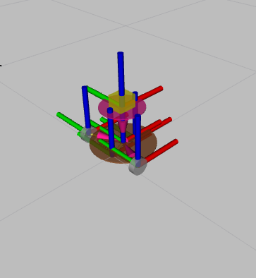
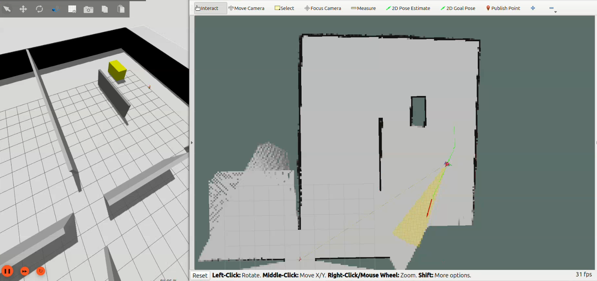
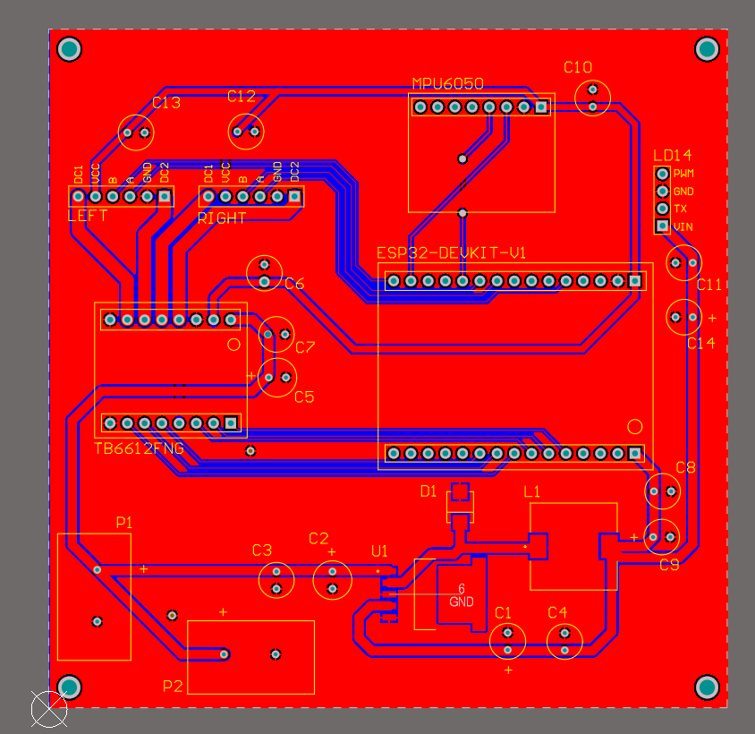
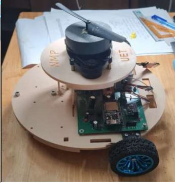

# Autonomous Mapping Robot

This repository contains the source code and configuration files for an **Autonomous Mapping Robot** project built with **ROS 2 Jazzy**.

The project supports both simulation and real robot execution. It includes robot description files, launch files, control configuration, LiDAR-based perception, mapping, path planning, and visualization tools.




## Features

- ROS 2 based autonomous mobile robot system
- Gazebo simulation support
- Real robot launch configuration
- LiDAR-based perception
- Autonomous mapping
- Path planning
- Robot visualization with RViz2
- ROS 2 control integration

## Requirements

This project is developed and tested with:

- Ubuntu 24.04
- ROS 2 Jazzy
- Gazebo
- RViz2
- Python 3

Install the required ROS 2 packages:

```bash
sudo apt update
sudo apt install ros-jazzy-sensor-msgs
sudo apt install ros-jazzy-urdf-tutorial
sudo apt install ros-jazzy-tf2-tools
sudo apt install ros-jazzy-xacro
sudo apt install ros-jazzy-rqt-image-view
sudo apt install ros-jazzy-ros2-control ros-jazzy-ros2-controllers
sudo apt install ros-jazzy-rclcpp-lifecycle
```


## Build

From the workspace root directory, run:

```bash
colcon build
source install/setup.bash
```

## How to Run

### Simulation

To run the robot in Gazebo simulation:

```bash
ros2 launch my_robot_description my_robot.launch.xml
```

The simulation package allows you to test the robot on your computer without real hardware.



### Real Robot




To run the real robot system:

```bash
ros2 launch real_car_description my_robot.launch.xml
```

Make sure the required hardware, sensors, motor controller, and serial connections are properly configured before launching the real robot.

This project uses two serial ports in the configuration file: 

1: /dev/ttyUSB0 for esp32

2: /dev/ttyUSB1 for LiDar
(Be careful to check the correct port)

## Notes

Basic knowledge of ROS 2 is recommended to build, modify, and run this project.

Before running the project, make sure you have sourced both ROS 2 and the workspace:

```bash
source /opt/ros/jazzy/setup.bash
source install/setup.bash
```

This source code is still under development and not fully optimized. However, it can run and provide a basic understanding of how to build a robot system that can create a map using ROS 2, LiDAR, Gazebo, and RViz2.


You can watch the robot running demo on my YouTube channel
